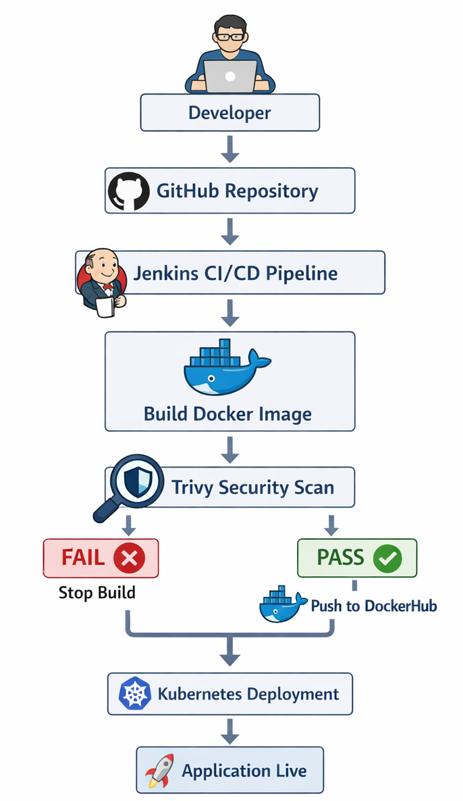
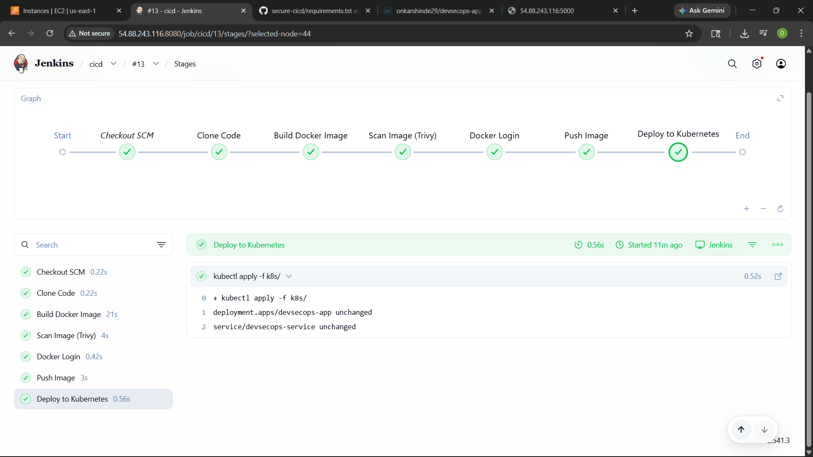
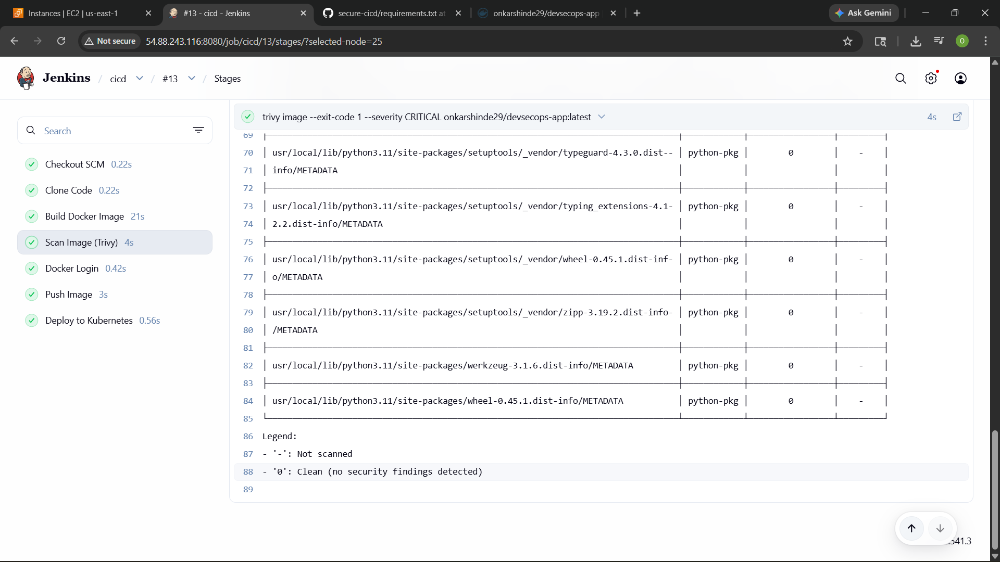
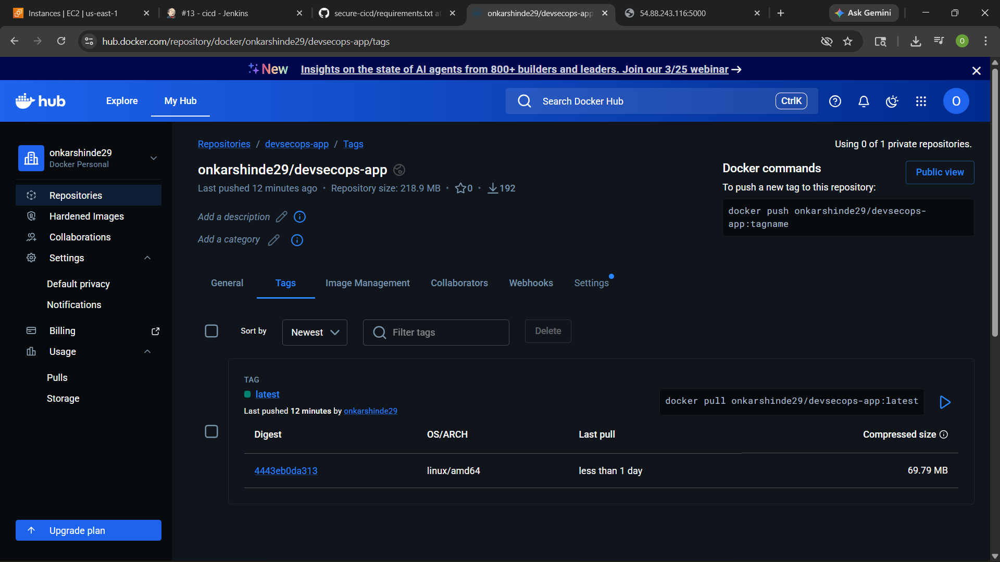
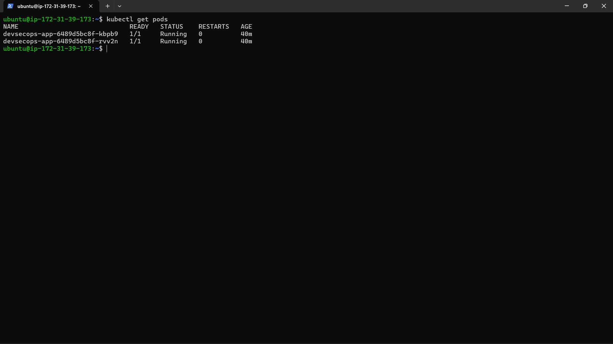
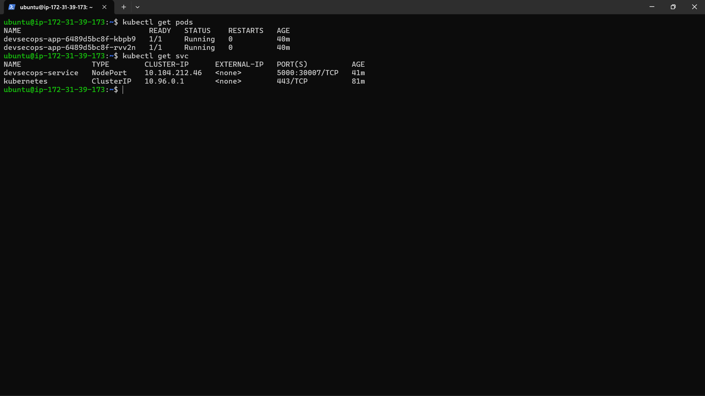
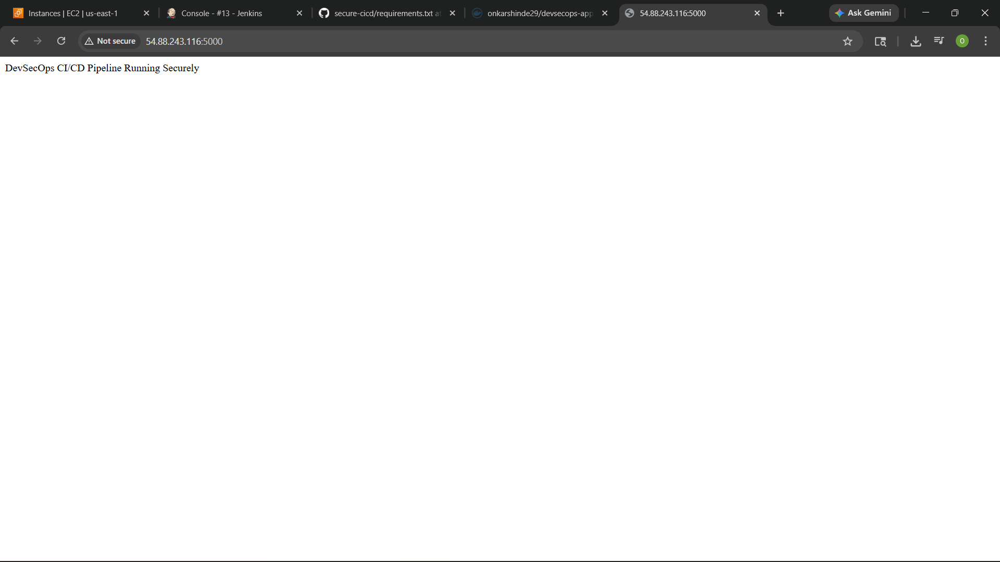

# 🔐 CI/CD Pipeline with Automated Docker Security Scanning & Kubernetes Deployment

---

## 📌 Project Overview

This project demonstrates a **DevSecOps-based CI/CD pipeline** where Docker images are automatically scanned for vulnerabilities before being deployed to Kubernetes.

🚨 Problem: Vulnerable containers reached production  
✅ Solution: Enforce **security gating in CI/CD pipeline**

---

## 🎯 Objectives

- Containerize application using Docker
- Scan Docker images using Trivy
- Fail build if HIGH/CRITICAL vulnerabilities found
- Deploy only secure images to Kubernetes
- Automate complete CI/CD workflow using Jenkins

---

## 🏗️ Architecture Diagram



---

## 🐳 Application Containerization

### Dockerfile

```dockerfile
FROM python:3.9-slim

WORKDIR /app

COPY app/requirements.txt .
RUN pip install --no-cache-dir -r requirements.txt

COPY app/ .

CMD ["python", "app.py"]
```

---

## ⚙️ Jenkins Pipeline (CI/CD)

### Jenkinsfile

```groovy
pipeline {
    agent any

    environment {
        IMAGE_NAME = "onkarshinde29/devsecops-app"
        TAG = "latest"
        KUBECONFIG = "/var/lib/jenkins/.kube/config"
    }

    stages {

        stage('Clone Code') {
    steps {
        git url: 'https://github.com/onkar-shinde29/secure-cicd-devsecops-k8s',
            branch: 'main'
    }
}

        stage('Build Docker Image') {
            steps {
                sh 'docker build -t $IMAGE_NAME:$TAG .'
            }
        }

        stage('Scan Image (Trivy)') {
            steps {
                sh '''
                trivy image --exit-code 1 --severity CRITICAL onkarshinde29/devsecops-app:latest
                '''
            }
        }

        stage('Docker Login') {
            steps {
                withCredentials([usernamePassword(
                    credentialsId: 'dockerhub-cred',
                    usernameVariable: 'DOCKER_USER',
                    passwordVariable: 'DOCKER_PASS'
                )]) {
                    sh 'echo $DOCKER_PASS | docker login -u $DOCKER_USER --password-stdin'
                }
            }
        }

        stage('Push Image') {
            steps {
                sh 'docker push $IMAGE_NAME:$TAG'
            }
        }

        stage('Deploy to Kubernetes') {
            steps {
                sh 'kubectl apply -f k8s/'
            }
        }
    }
}
```

---

## ☸️ Kubernetes Deployment

### deployment.yaml

```yaml
apiVersion: apps/v1
kind: Deployment
metadata:
  name: devsecops-app

spec:
  replicas: 2

  selector:
    matchLabels:
      app: devsecops-app

  template:
    metadata:
      labels:
        app: devsecops-app

    spec:
      containers:
      - name: app
        image: onkarshinde29/devsecops-app:latest
        ports:
        - containerPort: 5000
```

### service.yaml

```yaml
apiVersion: v1
kind: Service
metadata:
  name: devsecops-service

spec:
  type: NodePort

  selector:
    app: devsecops-app

  ports:
    - port: 5000
      targetPort: 5000
      nodePort: 30007
```

---

## 🔐 Security Gating Logic

- Trivy scans Docker image
- Only HIGH and CRITICAL vulnerabilities considered
- `--exit-code 1` → fails pipeline if vulnerabilities found
- Deployment stages run only on SUCCESS

👉 This ensures **no insecure image reaches Kubernetes**

---

## 🧪 Security Validation (Test Case)

Add vulnerable dependency:

```
flask
```

### Expected Result:

- Trivy detects vulnerability
- Pipeline fails ❌
- Deployment NOT triggered

---

## 🚀 Detailed Step-by-Step Setup (Single EC2 Implementation)

This project is fully implemented on **one EC2 instance** where all components run together:

- Jenkins
- Docker
- Trivy
- Minikube (Kubernetes)
- kubectl

---

### 🧩 Step 1: Launch EC2

- OS: Ubuntu 22.04
- Instance: t2.medium
- Ports: 22, 8080, 30000-32767

---

### 🐳 Step 2: Install Docker

```bash
sudo apt update
sudo apt install docker.io -y
sudo systemctl start docker
sudo systemctl enable docker
sudo usermod -aG docker ubuntu
newgrp docker
```

Verify:

```bash
docker run hello-world
```

---

### ☸️ Step 3: Install Minikube & kubectl

```bash
curl -LO https://storage.googleapis.com/minikube/releases/latest/minikube-linux-amd64
sudo install minikube-linux-amd64 /usr/local/bin/minikube

curl -LO "https://dl.k8s.io/release/$(curl -L -s https://dl.k8s.io/release/stable.txt)/bin/linux/amd64/kubectl"
sudo install -o root -g root -m 0755 kubectl /usr/local/bin/kubectl
```

Start:

```bash
minikube start --driver=docker
kubectl get nodes
```

---

### 🔐 Step 4: Install Trivy

```bash
wget https://github.com/aquasecurity/trivy/releases/latest/download/trivy_0.50.0_Linux-64bit.deb
sudo dpkg -i trivy_0.50.0_Linux-64bit.deb
```

---

### ⚙️ Step 5: Install Jenkins

```bash
sudo apt install openjdk-17-jdk -y

curl -fsSL https://pkg.jenkins.io/debian/jenkins.io-2023.key | sudo tee \
/usr/share/keyrings/jenkins-keyring.asc > /dev/null

echo deb [signed-by=/usr/share/keyrings/jenkins-keyring.asc] \
https://pkg.jenkins.io/debian binary/ | sudo tee \
/etc/apt/sources.list.d/jenkins.list > /dev/null

sudo apt update
sudo apt install jenkins -y
sudo systemctl start jenkins
```

---

### 🔌 Step 6: Configure Jenkins

Install plugins:
- Pipeline
- Git
- Docker Pipeline

---

### 🔗 Step 7: Connect Jenkins with Docker

```bash
sudo usermod -aG docker jenkins
sudo systemctl restart jenkins
```

---

### ☸️ Step 8: Connect Jenkins with Kubernetes

```bash
sudo mkdir -p /var/lib/jenkins/.kube
sudo cp ~/.kube/config /var/lib/jenkins/.kube/
sudo chown -R jenkins:jenkins /var/lib/jenkins/.kube
```

---

### 🔑 Step 9: Add DockerHub Credentials

- Jenkins → Manage Credentials
- Add DockerHub username/password

---

### 📁 Step 10: Push Code to GitHub

```bash
git init
git add .
git commit -m "initial commit"
git remote add origin <repo>
git push -u origin main
```

---

### 🔁 Step 11: Create Pipeline Job

- New Item → Pipeline
- Use SCM → GitHub repo
- Jenkinsfile path: `jenkins/Jenkinsfile`

---

### ▶️ Step 12: Run Pipeline

Stages:

- Clone
- Build
- Trivy Scan
- Push
- Deploy

---

### 🧪 Step 13: Validate Deployment

```bash
kubectl get pods
kubectl get svc
```

---

### ❌ Step 14: Test Security Failure

Add vulnerable package:

```
flask
```

Pipeline should FAIL at scan stage

---

## 📸 Screenshots 

### Jenkins pipeline SUCCESS



### Trivy scan result (CLI output)



### Docker image pushed to DockerHub



### Kubernetes pods running (`kubectl get pods`)



### Kubernetes service (`kubectl get svc`)



### Application running in browser (NodePort)




---

## 🔄 Deployment Workflow

1. Developer pushes code to GitHub
2. Jenkins triggers pipeline
3. Docker image is built
4. Trivy scans image
5. If secure → push image
6. Deploy to Kubernetes

---

## 🚀 Advanced Enhancements

- 🔹 Integrate GitHub Actions instead of Jenkins
- 🔹 Use AWS EKS instead of Minikube
- 🔹 Add Helm charts for deployment
- 🔹 Store secrets in AWS Secrets Manager
- 🔹 Use private Docker registry (ECR)
- 🔹 Generate HTML vulnerability reports
- 🔹 Add Slack/email notifications

---

## 💡 Key Learning Outcomes

- DevSecOps implementation
- CI/CD pipeline automation
- Container security best practices
- Kubernetes deployment automation
- Shift-left security approach

---

## 🏁 Conclusion

This project ensures **secure, automated, and reliable deployment** by integrating security scanning into CI/CD pipeline.

---

## 👨‍💻 Author

Onkar Shinde

